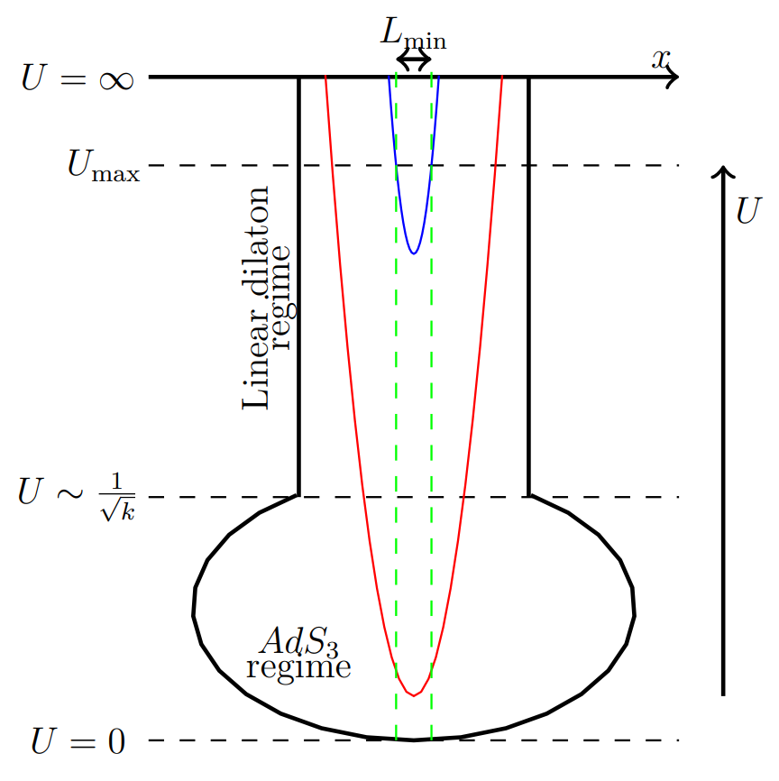

# [1805.06286] [Chakrabortya, Giveona, Itzhakib, Kutasov] Entanglement beyond AdS

<!-- @import "/assets/mathjax.html" -->

### A Different $T\overline{T}$ Duality

- **Different sign** from H. Verlinde et al [1611.03470], or Silverstein et al [1909.13808].

- **Different dual geometry:** $\mcal{M}_3\times \mcal{N}$, AdS now sits in the *interior* while near the boundary we have a linear dilaton background. In other words,

  - IR: small $U,\ \mcal{M}_3 = \mrm{AdS}_3$
  - UV: large $U,\ \mcal{M}_3 = \mathbb{R}^{1,1}\times \mathbb{R} _\phi$

  No longer a cutoff geometry, except a $U_{\max}$ manually introduced for regularization.

- There is a **minimum entanglement length** $L_{\min}$: as the peak of the minimal surface $U_0\to\infty$, $L$ does not shrink to zero but is bounded from below: $L\to L_{\min}$. See Fig 1.

- The notation is slightly misleading: note that $U_{\max}$ does not correspond to $L_{\min}$; $U_{\max}$ is manually introduced, while $L_{\min}$ can be found as $U\to\infty$, _without  any cutoff!_

## C-function

Cutoff-independent C-function (per CGIK's convention; Silverstein does not have this extra pre-factor of 3):

$$
  C(L) = 3L\,\pdv{S_{EE}(L)}{L}
  \tag{CGIK, 1.2}
$$

Field theory calculation, similar to Donnelly & Shyam, [1806.07444]:

- Deformation parameter: $\lambda$, or $(-\mu)$ in [1806.07444]. Trace flow equation (1.3) should be independent of $(\mop{sign} \lambda)$. Solution of $T_{ab}$ is given by (2.2).

- $\pdv{\,\log Z}{L}$ is related to $T^a_a$; with Kutasov et al's convention, we get:

  $$
    L\,\pdv{\,\log Z}{L}
    = -\frac{2L^2}{\lambda} \pqty{
      \sqrt{1 - \frac{c\lambda}{3L^2}} - 1
    }, \\
    \pdv{\,\log Z}{L}
    = -\frac{2}{\lambda} \pqty{
      \sqrt{L^2 - \frac{c\lambda}{3}} - L
    }, \tag{DS, 2.3$'$}
  $$

  The square root is real iff. $
    L \ge \sqrt{\frac{c\lambda}{3}}
    = L_0
  $.

  > **Conventions:**
  >
  > - [1806.07444] Donnelly & Shyam: $L = 2r,\ \mu = -2\pi\lambda$
  > - [1909.13808] Silverstein et al: $L = 2r$

- Compare (cf. PengXiang's note):

  $$
    L_0
    = \sqrt{\frac{6k\cdot 2\alpha'}{3}}
    = 2\sqrt{k\alpha'}, \\
    L_{\min}
    = \frac{\pi}{2}\sqrt{k\alpha'}
    = 1.57 \sqrt{k\alpha'},
  $$

  If I've got their conventions right, then **they don't match quantitatively**. _But I am confused about conventions so I could be wrong!_

  Note: $L_{\min}$ is the lower bound produced from holography (RT) by Kutasov et al. Here $k$ is the level of the _worldsheet_ $\mathrm{SL}(2,\mathbb{R})$ current algebra.

  > **Correspondence:** $c = 6k,\ \lambda = 2\alpha'$. _Why?_ I have not yet understood this, might need to check Kutasov's original: [1701.05576].

- A convenient substitution for the integral:

  $$
    L
    = L_0 \cosh x
    = \sqrt{\frac{c\lambda}{3}} \cosh x,
  $$

  $$
  \begin{aligned}
    \log Z
    &= -\frac{2}{\lambda} \frac{c\lambda}{3}
      \int \dd{x}\,\sinh x \cdot \pqty{
        \sinh x - \cosh x
      } \\
    &\sim - \frac{c}{3}
      \pqty{
        -x - \frac{1}{2} e^{-2x}
      } \\
    &\sim \frac{c}{3}\,
      \cosh^{-1} \frac{L}{L_0}
      + \frac{L^2}{\lambda}\,\pqty{
        1 - \sqrt{1 - \pqty{\frac{L_0}{L}}^{\!\!2}}
      },
  \end{aligned}
  $$

  $$
    S
    = \pqty{
        1 - \frac{L}{2} \frac{\pd}{\pd L}
      } \log Z
    = \frac{c}{3}\,\cosh^{-1} \frac{L}{L_0},
  $$

  $$
    C(L)
    = 3L\,\pdv{S}{L}
    = \frac{c}{\sqrt{1 - \frac{c\lambda}{3L^2}}}
  $$

  **Note:** $\log Z$ and $S$ might differ by an $L$-independent "constant", but that is eliminated in $C(L)$ due to the $L$-derivative.

## RT calculation

Here we check the RT calculation, with the help of ADS (Apolo, Detournay & Song) [1911.12359] when it comes to confusing conventions.

**From now on, we default to the convention of ADS [1911.12359]**

The metric, B-field and dilation

- at finite temperature ($T_u, T_v$)
- in string frame
- in static patch

are given by ADS (3.13). Setting $T_u = T_v = 0,\ p = 1$, the asymptotically AdS part of the metric is reduced to:

$$
  \dd{s}^2
  = \ell^2 \pqty{
    \frac{\dd{r}^2}{4r^2}
    + \frac{r\dd{u}\dd{v}}{1 + 2\lambda r}
  },\\
  u,v = \varphi \pm t/\ell,
  \tag{ADS, 3.13$'$}
  \label{eq:staticMetric}
$$

This should correspond to CGIK (2.3). The finite temperature version should roughly correspond to CGIK (5.1).

The $\lambda$ in \eqref{eq:staticMetric} is the string theory deformation parameter; by ADS (2.43) and ADS, Section 2.3, we have:

$$
  \lambda
  = \frac{k}{\ell^2} \mu,
  \quad
  k = \ell^2/\ell_s^2
  \tag{ADS, 3.13$'$}
$$

$$
  \lambda
  = \mu / \ell_s^2
  \tag{ADS, 3.38$'$}
$$

### Conventions

By comparing the $\abs{w} = 1$ spectrum:

$$
  E = - \frac{R}{2\mu} \Bqty{
    1 - \sqrt{
      1 + \frac{4\mu}{R} E(0)
      + \frac{4\mu^2}{R^4} J(0)
    }
  }, \tag{ADS, 3.39$'$}
$$

With the one in Silverstein et al (LLST) [1909.13808]:

$$
  E \propto E_S = \frac{2R}{\lambda_S} \Bqty{
    1 - \sqrt{
      1 - \frac{\lambda_S}{2\pi R} E(0)
      + \frac{\pi^2\lambda_S^2}{(2\pi R)^4} J(0)
    }
  },
\tag{LLST, 2.7$'$} \\
  E(0)
  = 2\pi \pqty{
      \Delta + \bar{\Delta} - \tfrac{c}{12}
    },\quad
  J(0)
  = 2\pi \pqty{
      \Delta - \bar{\Delta}
    },
$$

$\lambda_S$ is the deformation parameterin Silverstein et al's convention. We have a correspondence:

$$
  \frac{\lambda_S}{2\pi}
  = -4\mu_{\mathrm{ADS}},\quad
  \lambda_S = -8\pi\mu_{\mathrm{ADS}}, \\
  E_S = \frac{1}{2\pi} E_{\mathrm{ADS}}
$$

_Thank Luis for help with this!_ With the conventions sorted out, let's try to compute the geodesic with \eqref{eq:staticMetric}.

### Poincare Patch

At first glace \eqref{eq:staticMetric} may resemble the metric in some "polar" coordinates, but in fact it's more closely related to the Poincare coordinates. Recall that BTZ comes from the quotient of Poincare patch. To see this more explicitly, we can take $r = \frac{1}{\rho^2}$, which gives:

$$
  \dd{s}^2
  = \ell^2 \pqty{
    \frac{\dd{\rho}^2}{\rho^2}
    + \frac{\dd{u}\dd{v}}{\rho^2 + 2\lambda}
  },\\
  u,v = \varphi \pm t/\ell,
  \tag{ADS, 3.13$''$}
  \label{eq:staticMetricPoincare}
$$
