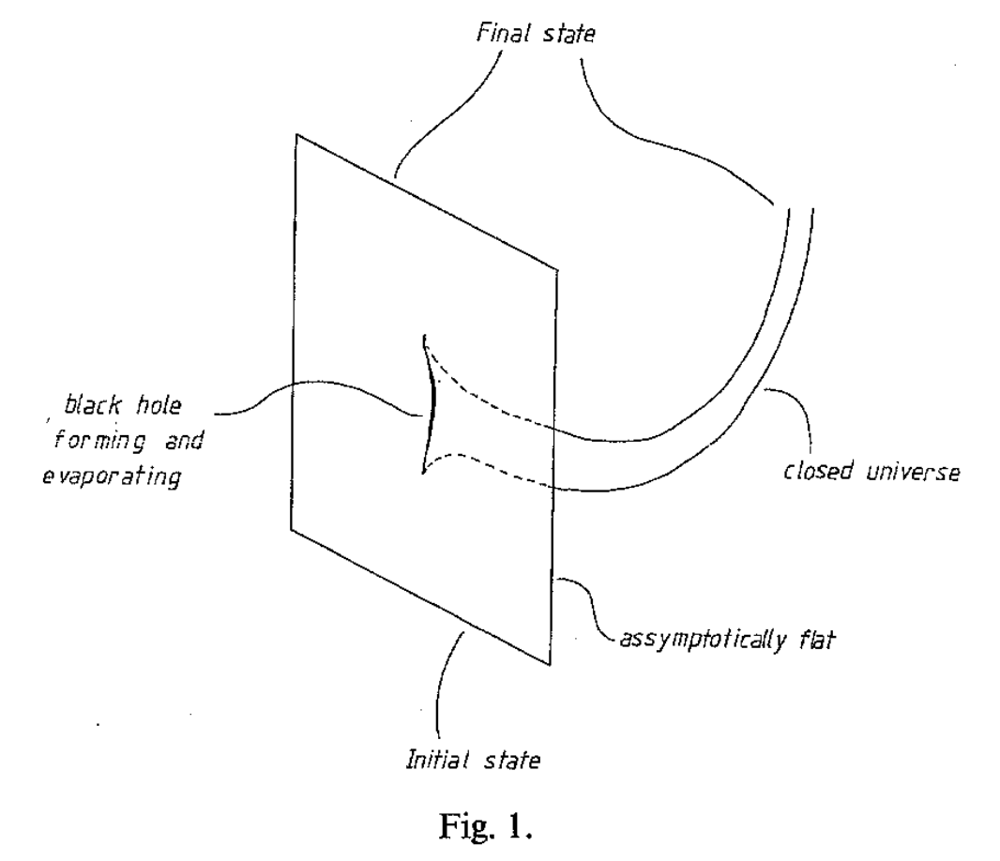
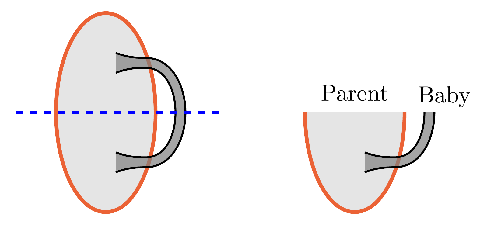
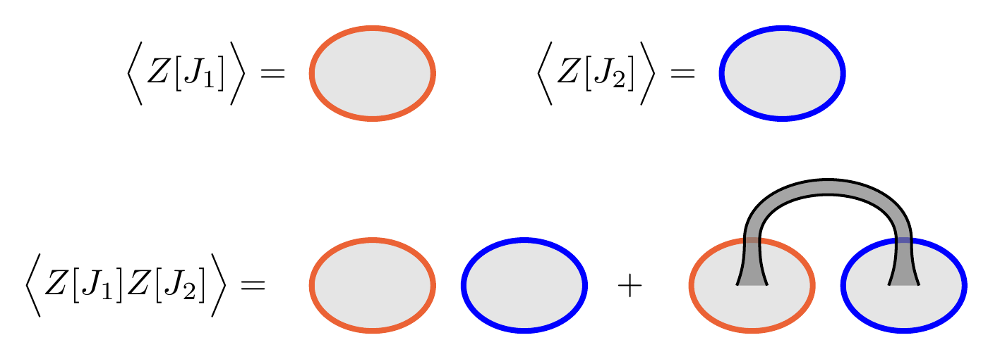
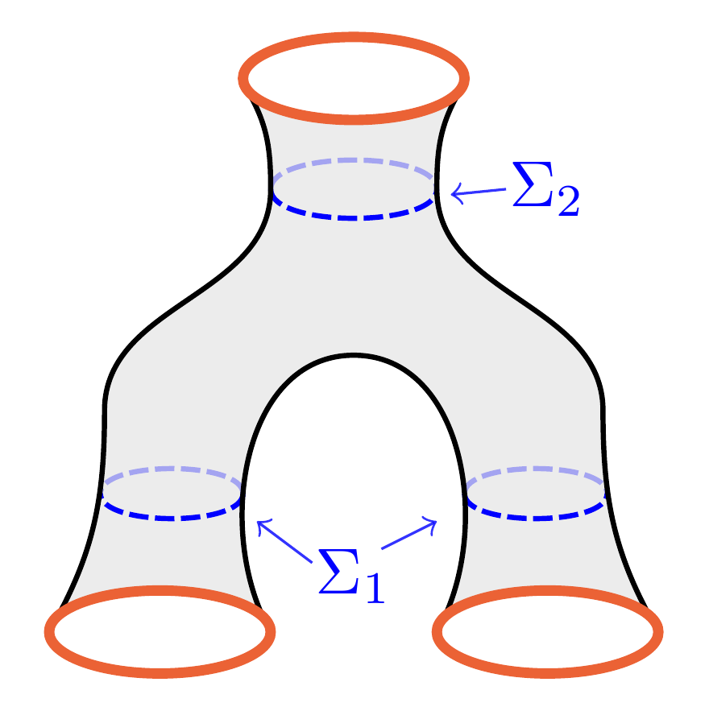
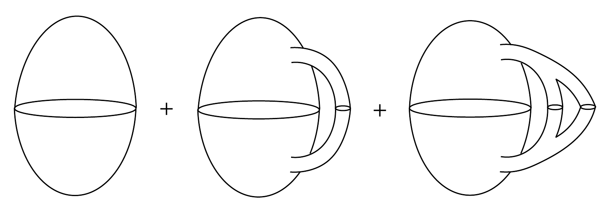
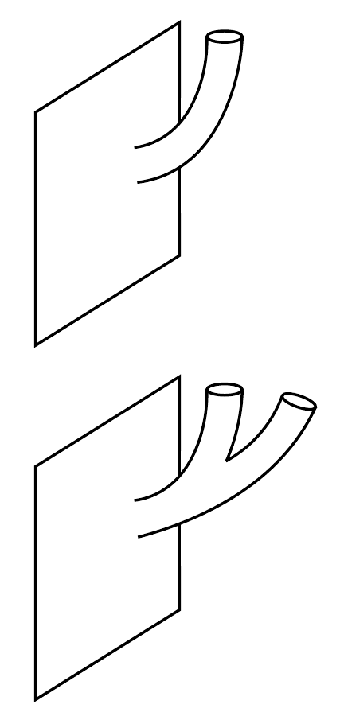
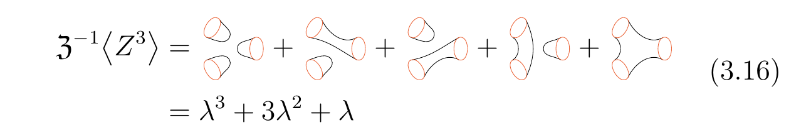

# [2002.08950] [Marolf, Maxfield] Transcending the ensemble

<!-- @import "/assets/mathjax.html" -->

## Synopsis

- Gravitational path integral of a **toy model: topological 2D gravity**, with detailed calculations. Dual boundary theory seems to be an ensemble of theories with some unfixed parameter, $Z = Z_\alpha$.

- An **instruction manual** of constructing the baby universe Hilbert space $\mathcal{H}_{\mathrm{BU}}$. Insertion of boundary behaves as an adjoint operator $\hat{Z}$ in $\mathcal{H}_{\mathrm{BU}}$, which creates / annihilates BUs.

- A proposal to **transcend the ensemble:** BU states basically "purifies" the ensemble of theories; If we impose a BU state $\ket{\alpha}$, then the boundary theory is fixed with parameter $\alpha$.

- And more ...

## Concepts

- **Baby universe (BU):** Spacetime with compact Cauchy surfaces, i.e. has no (asymptotic) boundary. Arise when considering _spacetime wormholes_.

  

  

- **Spacetime wormholes:** geometry localized in _both_ space and time. Differ from **spatial wormholes** - the ones found in a maximally extended Lorentzian Schwarzschild black hole.

- We work in Euclidean signature, thus "spacetime wormholes" are **Euclidean wormholes**. _In principle,_ the formalism here applies to either signature.

## Setup

- $g_{\mu\nu} \in \Phi$: a set of bulk fields, with boundary conditions labeled by $J$: $\Phi\sim J$. Boundary condition $\to$ _smeared_ operator insertion:

  $$
    \int_{\pd B}
      \dd^n{x}\,
      J(x)\,\hat{\mathcal{O}}(x)
  $$

  Contraction of indices suppressed: $
    J(x)\,\hat{\mathcal{O}}(x)
    = J_\bullet(x)\,\hat{\mathcal{O}}^\bullet(x)
  $.

- Gravitational path integral $\to$ partition function $Z[J]$, promoted to the VEV of an exponential operator: $\langle \hat{Z}[J] \rangle$.

  > Recall the usual **AdS/CFT dictionary:**
  >
  > $$ \ave{\hat{Z}[J]}_{\pd B}
      = \mathcal{Z}_{B}
        \bqty{\Phi|_{\pd B}\sim J},\quad
      B = \mathrm{Bulk} $$
  >
  > The partition function of the boundary $Z[J]$ is promoted to an operator exponential:
  >
  > $$ \hat{Z}[J]
      \sim \exp \int_{\pd B}
        \dd^n{x}\,J(x)\,\hat{\mathcal{O}}(x) $$

- Without AdS/CFT, we can nevertheless _**define the notation:**_

  $$ \ave{
      Z[J_1]\cdots
      Z[J_n]
    } \equiv \int_{
        B, \ \Phi|_{\pd B_i}\sim J_i
      }
      \DD\Phi\,e^{-S[\Phi]}
  \tag{2.1}
  \label{eq:def-Z-correlator} $$

  With $n$ boundary components. Here AdS/CFT serves as the original motivation, but the formalism by itself can be developed in a self-consistent way without duality.

- In fact, $\ave{\cdots}$ involving multiple boundaries can _**not**_ be interpreted as a standard AdS/CFT correlator, since:

  $$
    \ave{Z[J_1] Z[J_2]}
    \ne \ave{Z[J_1]} \ave{Z[J_2]}
    \tag{2.2}
  $$

  

  > In standard AdS/CFT, we **should expect $\ave{Z[J_1] Z[J_2]}$ to factorize**, since it's the partition function between two **local, Euclidean** field theory. See the discussions in:
  >
  > - [0705.2768] _Nima, Orgera & Polchinski:_ The ends of a wormhole can be arbitrarily separated in time, so that amplitudes will not satisfy cluster decomposition, whereas the dual gauge theory has local time evolution and so will satisfy cluster decomposition.
  >
  > - [hep-th/0401024] _Maldacena and Maoz:_ Lorentzian geometries with multiple asymptotic boundaries are such that boundaries are separated by horizons (this is called _topological censorship_, see hep-th/9912119), as long as the boundaries have more than one dimension. In this case one can interpret the geometries as dual to entangled states of the various field theories living on each boundary. _Example: TFD._
  >
  > I admit I am a bit confused about this. **My understanding:**
  >
  > - A thermal background is created by a horizon separating entangled degrees of freedom.
  >
  > - Non-zero correlations between Lorentzian theories can then be achieved by a locally thermal but globally entangled background.
  >
  > - There are no horizons in Euclidean theories, and there are no natural way to define such backgrounds.

  Then how should we interpret $\ave{\cdots}$? **Answer:** ensemble average over a family of theories. **Why?** We neglect something that "purifies" the ensemble in the usual AdS/CFT picture --- the BU states.

  

- BU has no boundary ($\varnothing$), hence is (falsely) neglected in the dual description. We can recover its contribution by explicit construction of the BU Hilbert space (a sector of the full Hilbert space).

## Formal Construction of $\mathcal{H}_{\mathrm{BU}}$

- States are obtained by cutting open correlators, which are defined by gravitational path integral \eqref{eq:def-Z-correlator}.

  $$
    \ave{
      Z[\tilde{J}_1]\cdots
      Z[\tilde{J}_2]
      \big|
      Z[J_1]\cdots Z[J_m]
    }
    = \ave{
      Z[\tilde{J}^*_1]\cdots
      Z[\tilde{J}^*_2]\,
      Z[J_1]\cdots Z[J_m]
    }
    \tag{2.5}
    \label{eq:def-Z-states}
  $$

  

- No boundaries ($m = 0$): Hartle-Hawking state $\ket{\mathrm{HH}}$

  

    $\ave{1}$ = $\bra{\mathrm{HH}}\ket{\mathrm{HH}} = $  $ + \cdots$
     
  

  This is like the "vacuum diagrams", while boundary components are like "external legs" to the diagram.

- Define $\widehat{Z[J]}$ as creation operator:

  $$
    \ket{Z[J_1]\cdots Z[J_m]}
    = \widehat{Z[J_1]} \cdots
      \widehat{Z[J_m]}
      \ket{\mathrm{HH}}
    \tag{2.12}
  $$

  Intuitively, $\widehat{Z[J]}$ adds a boundary component to the previous state. Note that permutations of $J_i$ does not change the path integral / state, which means that:

  $$
    \bqty{
      \widehat{Z[J]}, \widehat{Z[J']}
    } = 0
  $$

  Also by \eqref{eq:def-Z-states}, $
    \widehat{Z[J]}^\dagger
    = \widehat{Z[J^*]}
  $.

  > Note that this $\widehat{Z[J]}$ has the same properties as Coleman's $A_i$ operator. Recall that Luis showed us last time that summing over the BUs leads to an effective Hamiltonian:
  >
  > $$ \mathscr{H} = \mathscr{H}_0(x)
      + \sum_i \mathscr{H}_i(x) A_i,\quad
      [A_i,A_j] = 0 $$
  >
  > Here $A_i\to a_i + a^\dagger_i$ if we assume that the creation/annihilation of baby universes happens one at a time. $a^\dagger_i$ is the creation operator for a BU of some "type" $i$.
  >
  > 

- Simultaneous eigenstates of $\widehat{Z[J]}$ --- $\alpha$-states:

  $$
    \widehat{Z[J]} \ket{\alpha}
    = Z_\alpha[J] \ket{\alpha},\quad
    \forall\ J\colon\ \text{all kinds of b.c.}
  $$

  $α$-states define a preferred orthonormal basis for $\mathcal{H}_ {\mathrm{BU}}$; by inserting $
      \sum_\alpha \ket{\alpha}\bra{\alpha}
    $, we find that:

  $$ \ave{
      Z[J_1]\cdots Z[J_n]
    } = \ave{1}
        \sum_\alpha p_\alpha
          Z_\alpha[J_1]\cdots Z_\alpha[J_n]
    \tag{2.22}
  $$

  Here $
    p_\alpha = \abs{
        \bra{\mathrm{HH}}\ket{\alpha}
      }^2 / \ave{1},
    \ave{1} = \bra{HH}\ket{HH}
  $.

### Ensemble interpretation

$$ \ave{
    Z[J_1]\cdots Z[J_n]
  } = \ave{1}
      \sum_\alpha p_\alpha
        Z_\alpha[J_1]\cdots Z_\alpha[J_n]
  \tag{2.22}
$$

- The parameters $α$ label the various theories in the ensemble, the eigenvalues $Z_α [J]$ give definite values for observables in the theory associated with the particular label $α$, and $p_α$ gives the probability of selecting $α$ from the ensemble.

- $\{\alpha\}$ are in one-to-one correspondence with members of the ensemble, and $\mop{span} \{\alpha\} = \mathcal{H}_{\mathrm{BU}}$.

  > Entanglement with BU typically led the rest of the theory (here the asymptotically AdS sector) to act as if it were part of an ensemble of theories. However, a particular member of the ensemble could be chosen by selecting an appropriate baby universe state ($\ket{\alpha}$).

- If the initial state of the baby universes is an $α$-state, this selects a single member of the ensemble so that amplitudes factorize:

  $$
    \mel{\alpha}{Z[J_1] Z[J_2]}{\alpha}
    = \mel{\alpha}{Z[J_1]}{\alpha}
      \mel{\alpha}{Z[J_2]}{\alpha}
    \tag{2.23}
  $$

## Topological 2D gravity

$$
  S(M) = - S_0 \chi(M) - S_\pd n(M)
  \tag{3.3}
$$

Here $M$ is some 2D surface,

- $\chi(M)$: Euler characteristic
- $n(M)$: number of boundaries

This $S_0$ term in the action can be obtained from the usual Einstein--Hilbert + Gibbons--Hawking action, using _Gauss–Bonnet theorem_. The $S_\pd$ term can be interpreted as local degrees of freedom residing on the boundaries.

The usefulness of the second term can be seen as follows: the formula of $\chi$ gives:

$$
  S = -S_0 \sum_{c.c.} (2-2g)
    + (S_0 - S_\pd)\,n
$$

The sum goes over connected components (c.c.). We see that it is convenient to choose $S_\pd = S_0$ so that $n$ drops out from the action. Even if $S_\pd \ne S_0$, the effect of the second term with fixed $n$ (fixed number of boundaries) is just a overall rescale $e^{-S_\pd n}$ of the path integral.

**Analog of AdS/CFT:** the boundary "CFT" is now a 1D TQFT (topological quantum mechanics). The only observable is $\idty$, or more precisely, its trace:

$$ \Tr_{\mcal{H}_{\mrm{CFT}}} \idty
  = \dim \mathcal{H}_{\mathrm{CFT}}
  = Z[J] = Z
  \tag{3.8}
$$

This is a variable that specifies the boundary theory; in fact, **we've found the _ensemble of theories_**: it is a collection of 1D TQFTs with various (integer) dimensions, $Z = Z_\alpha \in \mathbb{Z}_{\ge 0}$.

This theory is so simple that we are unable to specify a boundary condition $J$. Such degrees of freedom can be manually introduced by considering EOW branes.

### Gravitational Path Integral

$$ \int \DD\Phi\,e^{-S}
  = \sum_M \mu(M)\, e^{-S}
$$

The quantum theory in the bulk is not yet defined: we need to find an appropriate measure $\mu(M)$. Here they simply take the naive assumption:

$$
  \mu(M) = 1,\quad
  \forall\ M\colon\ \text{
    connected to the boundaries
  }
$$

Example:

Each connected component contributes a factor of $\lambda$.

What is $\lambda$ exactly? We can attach any number of handles on each connected component; summing over the number of handles gives an effective coupling $\lambda$. This is in fact included in (3.16) but suppressed in the diagrams.

$$
  \lambda
  = \sum_{
      \begin{aligned}
        M\colon
        &\ \mathrm{connected}, \\[-1ex]
        &\ \mathrm{compact}
      \end{aligned}
    } e^{-(-S_0)\,\chi}
  = \sum_{g = 0}^\infty
    e^{S_0(2-2g)}
  = \frac{e^{2S_0}}{1-e^{-2S_0}}
  \tag{3.9}
$$

In QFT, the sum over disconnected diagrams is simply the exponential of the sum over connected diagrams. We would _**like**_ to preserve this property, i.e.

$$
  \ave{1} = e^\lambda
  \tag{3.10}
$$

This implies that we should _**choose**_ the following symmetry factor for disconnected geometries:

$$
  \mu(M) = \prod_g \frac{1}{m_g!}
  \tag{3.2}
$$

Here $M$ is the disjoint union of compact surfaces, $m_g$ is the number of genus-$g$ surfaces in $M$.

It is then straight-forward to compute $\ave{Z^n}$ using generating functionals, just like in any other QFT. In this case $Z[J] = Z$ a simple number, so it's not so much a "generating function**al**" but just a "generating function". The final result is:

$$
  \begin{align}
    \ave{Z^n} / \ave{1}
    &= B_n(\lambda)
      = \texttt{BellB[n,$\lambda$]}
      \colon\ \text{Bell polynomial}
      \tag{3.15} \\
    &= \sum_{d = 0}^\infty
      d^n p_d(\lambda)
      \tag{3.19}
  \end{align}
$$

$ p_d(\lambda)
  = e^{-\lambda} \frac{\lambda^d}{d!}
$: Poisson distribution with mean = variance = $\lambda$. We see that $Z$ is a random variable, satisfying the classical Poisson distribution.

### $\mathcal{H}_{\mathrm{BU}}$ for the Toy Model

All states can be written as:

$$
  \sum_n c_n \ket{Z^n}
  \equiv \ket{\,\sum_n c_n Z^n}
  = \ket{f(Z)}
$$

It seems that $\mathcal{H}_{\mathrm{BU}}$ is equivalently, a space of functions $f\colon\ \mbb{R}\to\mbb{C}$.

$$
  \bra{g(Z)}\ket{f(Z)} / \ave{1}
  = \sum_{d = 0}^\infty
    p_d(\lambda)\,
    \overline{g(d)} f(d)
  \tag{3.22}
  \label{eq:inner-prod-covariance}
$$

However, note that if $f(\mathbb{Z}_{\ge 0}) = 0$, then even if $f$ has a non-trivial expansion $f = c_n Z^n$, it annihilates everything in inner products. These are the **null states**; they correspond to a non-trivial **gauge symmetry** of the system, an extension of the usual _diffeomorphism_ in the presence of multiple topologies.

To obtain the physical Hilbert space, we should quotient out the null states; this leaves us with $f(Z)$ that is non-zero at some $\mathbb{Z}_{\ge 0}$. We can then immediately write down a basis for the quotient space, e.g.

$$
  \ket{Z = d}
  \propto \ket{\frac{\sin \pi z}{Z - d}}
  \tag{3.25}
$$

$\ket{Z = d}$ is basically a Kronecker delta on $\mathbb{Z}_{\ge 0}$. Note that they are also the so-called $\alpha$-states --- eigenstates of operator $\widehat{Z}$, with eigenvalue $Z_\alpha = d$. $\widehat{Z}$ acts like a number operator as in the harmonic oscillator Hilbert space, so we can similarly define $a,a^\dagger$ such that $\widehat{Z} = a^\dagger a$, and $\ket{\mathrm{HH}}$ is a _coherent state_ in this description:

$$
  \ket{\mathrm{HH}}
  = e^{\sqrt{\lambda} a^\dagger} \ket{Z = 0}
$$

The distribution of the associated ensemble then follows from the well-known fact that the number operator follows a Poisson distribution in a coherent state.

$\widehat{Z}$ has a surprising **spacetime interpretation:** inner products with $\ket{Z = d}$ produce only $\propto \lambda^d$ terms, so is the diagram with $d$ connected components; see e.g. (3.16). Therefore,

- $\widehat{Z}$ counts the number of connected components of the spacetime!

- To work in an $α$-state $\ket{Z = d} \to$ to impose the _nonlocal constraint_ that spacetime has exactly $d$ connected components.

## More

- Hilbert space with boundaries / EOW branes; it is an extension of $\mathcal{H}_{\mathrm{BU}}$.

- Reflection positivity of the path integral leads to unitarity in $\mathcal{H}_{\mathrm{BU}}$, which further leads to a bound of von Neumann entropy in the Hilbert space. This bound coincides with the Bekenstein-Hawking entropy.

  > The proof is similar to that of the Cauchy-Schwarz inequality; see around (4.6), (4.7). Note that:
  >
  > - This bound is obtained with a fixed $\alpha$-sector;
  >
  > - If one wishes to consider the entropy of some density matrix on the full Hilbert space (and not just on a single $α$-sector) defined by some fixed set of sources, entanglement with baby universes will generally lead to much larger entropies that exceed the Bekenstein-Hawking bound and thus do not reproduce the expected Page curve. In this more mathematical sense, Hawking was correct.

---
