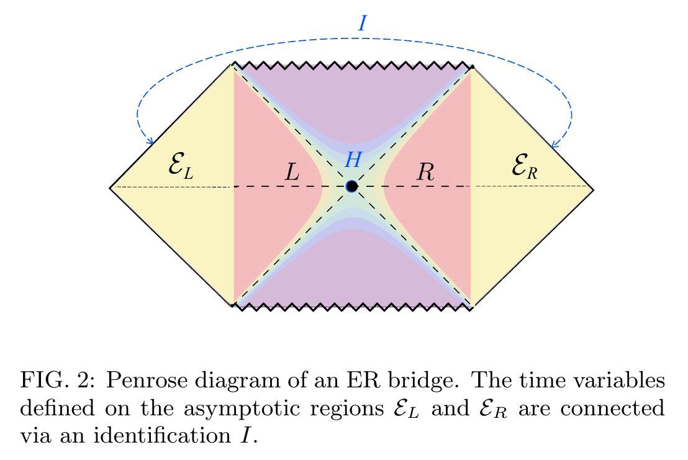

# [2003.13117] [H. Verlinde] Thermo-Mixed Double [TBC]

<!-- @import "/assets/mathjax.html" -->

### Traditional setup

- ThermoField Double

  $$
    \ket{\mrm{TFD}}
    = \sum_n \sqrt{p_n}\,
      \ket{n}_L \ket{n}_R
    \tag{2}
  $$

- Thermal Mixed

  $$
    \rho_R
    = \sum_{n_L} \ket{\mrm{TFD}} \bra{\mrm{TFD}}
    = \sum_n p_n\,
      \ket{n}_R \bra{n},\\
    p_n = \frac{e^{-\beta E_n}}{Z}
  \tag{3}
  $$

### New proposal

- Purified state with environment $\mcal{E}$

  $$
    \ket{\Psi}
    = \sum_n \sqrt{p_n}\,
        \ket{n}_L
        \ket{n}_R
        \ket{\psi_n}_{\mcal{E}}
    \tag{25}
  $$

- Thermo-Mixed Double **TMD** by tracing out $\mcal{E}$

  $$
    \rho_{\mrm{TMD}}
    = \sum_n p_n\,
      \ket{n}_L \bra{n}
      \otimes \ket{n}_R \bra{n}
    \tag{6}
  $$

  Furthermore, trace out $L$, and we recover $\rho_R$. Generally, given $\ket{\Psi}$ and then trace out difference types of $\mcal{E}$, we can arrive at different $\rho$, e.g. decoupled $\mcal{E}_{L,R}$ leads to factorized $\rho_L\otimes \rho_R$. This is discussed around (43).

## Entropy

- When viewed from one side, von Neumann

  $$
    S(\rho_R) = S_{BH}
  $$
  
  All models agree (incl. TFD, TMD, and the factorized mixed state).

- Mutual information:
  
  $$
    I_{L,R}
    = S_L + S_R - S_{L\cup R}
  $$

  captures the entanglement between left and right, and is different between models. A summary is given around (13). We have:

  $$
    S_{L\cup R} (\rho_{\mrm{TMD}})
    = -\tr \pqty{\rho \log \rho}
    = -\sum_n p_n \log p_n
    = S_{BH},\\
    \begin{aligned}
      S_{L\cup R} (\rho_L\otimes \rho_R)
      &= -\sum_{n_L,n_R} p_{n_L} p_{n_R}
        \log\,\pqty{p_{n_L} p_{n_R}\!} \\
      &= -\sum_{n_L,n_R} p_{n_L} p_{n_R}
        \pqty{\log p_{n_L} + \log p_{n_R}\!} \\
      &= \sum_{n_R} p_{n_R} S_{BH}
        + \sum_{n_L} p_{n_L} S_{BH} \\
      &= 2S_{BH},
    \end{aligned}
  $$

## A Modified ER = EPR

TBC

<!-- vim: set ts=2 sw=2: -->
