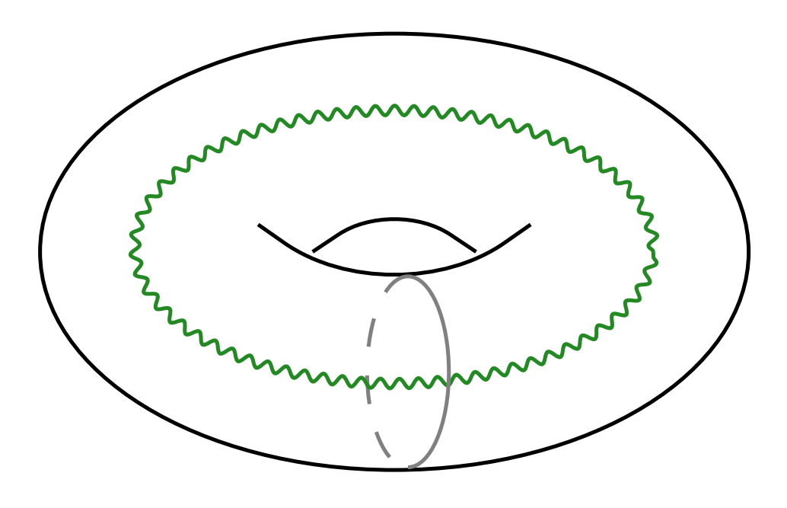

# [2004.14428] [Benjamin, Collier, Maloney] Conical Defects

<!-- @import "/assets/mathjax.html" -->

### Additional References:
- Maloney & Witten, [0712.0155]

## Pure Gravity := Smooth Euclidean Geometry

  - Euclidean BTZ has smooth geometry!

  - Conical singularities = massive particles, effectively adding additional matter fields, therefore no longer "pure".

  - Maloney, Witten and Keller [**MWK**]: _minimal_ strategy: including only smooth manifold. Conical singularities were briefly considered but later discarded. Issues: negative density of states (non-unitarity) in near-extremal regime.

**Resolutions: add new geometries**

  - "Non-classical" solutions (Seifert 3-folds): Maxfield and Turiaci [2006.11317]. Effectively adding conical singularities in the KK reduced 2D theory.

  - Conical singularities:

    - [1906.04184] Benjamin, Ooguri, Shao, Wang: dual CFT calculations
    - [2004.14428] Benjamin, Collier, Maloney:  geometric interpretation

  > Why we want a non-singular Euclidean geometry first?
  >
  > **My first guess:** from the perspective of gravitational path integral: we _input_ the inverse temperature $\beta$, and the non-singular geometry with $k = \frac{2\pi}{\beta}$ is selected for being the dominant saddle (for the Euclidean action).
  >
  > **However,** it seems that this is **_not_** true --- there seems to be nothing special about the $k = \frac{2\pi}{\beta}$ point of the classical action; it is **_not_** a saddle point of the classical action.
  >
  > **Some alternative explanations:** https://physics.stackexchange.com/q/86353.

<!-- vim: set ts=2 sw=2: -->
