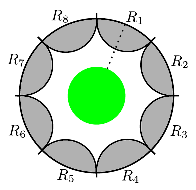
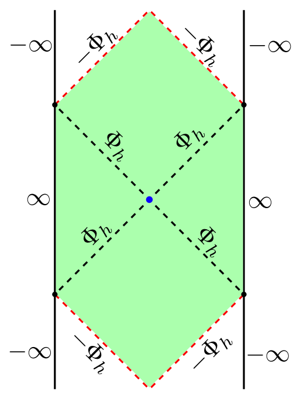
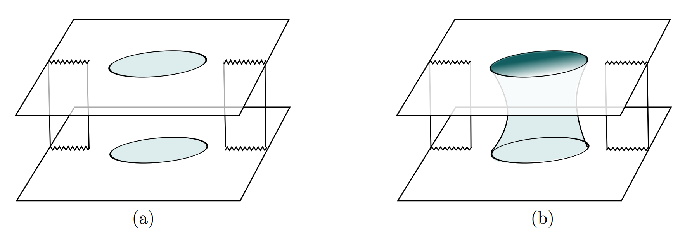
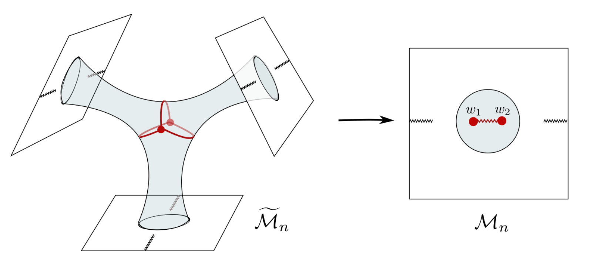
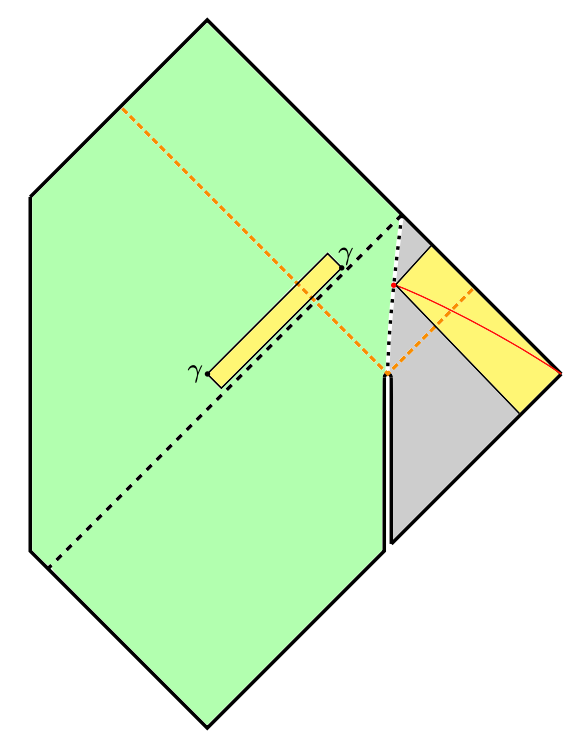
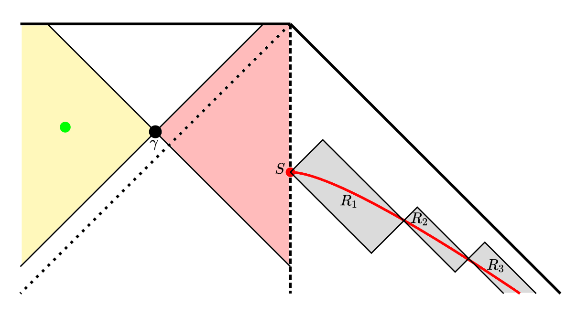

# [2010.10539] [Harlow, Shaghoulian] Global Symmetry & Euclidean Wormholes

<!-- @import "/assets/mathjax.html" -->

## Refs

- New: Harlow & Shaghoulian (H&S), 2010.10539
- Harlow & Ooguri (H&O)
  - Short: 1810.05337
  - Long: 1810.05338
  - Talk: https://youtu.be/uXdZXDMZm6o
- Original: Banks and Seiberg, 1011.5120
- JT
  - Harlow & Jafferis (H&J), 1804.01081
  - Talk: https://online.kitp.ucsb.edu/online/qgravity-c20/harlow/
- Island & Wormholes: 2006.06872
- Calculations:
  - 1905.08762
  - 1911.12333

## Claim: no-go!

**Claim: NO global symmetries in "quantum gravity"!**

What?! Why? Intuition: the charge of global symmetry:

$$
  Q[R] = \int_R \dd[3]{x} J^0
$$

Scales with **volume**, while the d.o.f. of a black hole scale with **area** --- Bekenstein--Hawking bound $S_{BH}$; i.e. the obstruction comes from the holographic nature of black holes.

**Ideas:**

- Black holes $\leadsto$ holographic systems: area law. Low dim "quantum gravity" without black holes provides some counter examples to this claim (see H&S, Section 2):
  - pt particle with einbein action
  - string worldsheet
  - (1+1) dim _canonically quantized_ JT
    - there are "remnants" that exceeds $S_{BH}$
    - _not_ a holographic theory!
    - global symmetries: allowed
- Counter counter example: JT quantized by Euclidean path integral
  - JT gravity as a matrix integral: not QM but an ensemble of QMs!
  - JT treated as effective field theory
  - no remnants in the end!
  - additional "island" contributions dominate at late times
  - information "escapes" through Euclidean wormhole
- Some charges also scale with area, e.g. electric charge:

  $$
    Q[R] = \int_{\,\boxed{\scriptsize \pd R}}
      \vec{E}\cdot \dd{\vec{\Sigma}}
  $$

  This is just Gauss's law. Therefore (some) gauge symmetries are allowed --- those are the so-called _"long-range"_ gauge symmetry.

**Remark: "quantum gravity"** in the **Claim** above should have the following properties:

1. Bekenstein--Hawking bound holds
2. The theory is "holographic"
3. Island emerges as the black hole evaporates
4. It can be constructed with Euclidean path integral

Relations between these properties? We have $(4) \To (3) \To (1)$, and $(2) \To (1)$, but others are not clear. H&S conjecture that $(4) \approx (2)$:

**Conjecture:** Euclidean path integral computes a UV completion that is _holographic_.

## Proof within AdS/CFT

**Tool: entanglement wedge (EW) reconstruction / subregion duality**

Global charge is in fact, "local" :joy: --- it can be localized in some finite region with insertions of charged operators. We _define_ global symmetry to act pointwise on _local_ fields:

$$
  U^\dagger(g)\,\mcal{O}(x)\,U(g)
  = D_n{}^m(g)\,\mcal{O}_m(x)
$$

The "global-ness" means that $U(g)$ does not depend on $x$.

**Proof:**
Bulk global symmetry $\leadsto$ boundary global symmetry $U(g)$; local action:
  
$$
  U(g)
  = U(g,R_1)\cdots U(g,R_n)
$$

$U(g,R_i)$ only has non-trivial action on $R_i$.
However, we can choose $R_i$ so that the EW contains no insertion! Hence:

$$
  U(g,R_i) \sim \idty,
  \quad\forall\ i,
  \label{eq:trivial_action}
$$

Hence $U(g) \sim \idty$, no non-trivial global symmetry. $\ \blacksquare$

**Subtleties: many!** One interesting thing related to quantum error correction (QEC): \eqref{eq:trivial_action} only holds in some code subspace $\mcal{H}_ {\text{code}}$. Don't worry! This holds in $\mcal{H}_ {\text{code}}$ _and_ $\mcal{H}_ {\text{phys}}$:

$$
  \mel{0}{\phi^\dagger U^\dagger \phi\,U}{0}
  = \mel{0}{\phi^\dagger \phi}{0}
$$

This is due to the fact that $\ket{0}, \phi\,\ket{0} \in \mcal{H}_ {\text{code}}$. Q: do we _choose_ to include $\phi\,\ket{0}$ in $\mcal{H}_{\text{code}}$? Need more explanation...

**Remark:** long-range gauge symmetry escapes this argument, since gauge-invariant operators are never "local"!

$$
  \tilde{\psi}(x)
  = \psi(x)\,\exp \pqty{
      iq \int_x^\infty A_\mu \dd{x^\mu}
    }
$$

Long range gauge symmetry reduces to global symmetry at $S_\infty$:

$$
  U(\theta)
  = \exp \pqty{
      \frac{i\theta}{q}
      \int_{S_\infty} \vec{E}\cdot \dd{\vec{\Sigma}}
    }
$$

TBC: asymptotic symmetries! The non-gauge part of a gauge symmetry.
**Q:** what about constant gauge transformation?

## JT Gravity

AdS/CFT: too strong, not realistic! $\leadsto$ holographic systems. How do we see that some theory of quantum gravity is holographic or not? Case study: JT gravity.

Different UV completions of JT gravity (H&J):

### Canonical quantization

JT gravity is renormalizable!

$$
  S \sim \frac{1}{16\pi G_N}
    \int \dd[2]{x}
      \Phi\,(R + 2) + \cdots
$$

Classical power counting: mass dim $
  [g] = 0, [x] = -1
$, $
  [\Phi] = 0,
  \ [R] = +2,
  \ [G_N] = 0
$.

$$
  0 = \var{S}
  = \int_M \dd[2]{x} \sqrt{-g}
      \ (\mathrm{EOM})
    + \int_{\pd M} \dd{x} \sqrt{\abs{\gamma}}
      \ (\mathrm{BC})
$$

Boundary conditions (BC) at the cutoff $r_c$ --- asymptotic $\mathrm{AdS}_ 2$. Classical solution: two-sided black hole. Singularities emerge at the $\infty$-ly blue-shifted surface. Given such BC, the solution to the EOM is _unique!_ With only one free parameter.

Details: H&J, Section 2. Conformal compactification: $x = \tan z$,

$$
  \dd{s}^2
  = (\sec{z})^2 \pqty{
      -\dd{\tau}^2 + \dd{z}^2
    },
  \quad z\in (-\tfrac{\pi}{2}, +\tfrac{\pi}{2}),
\\
  \Phi = \Phi_h \sec z \cos \tau
$$

Alternatively, use coordinates in the right patch: horizon $r_s = \Phi_h / \phi_b$,

$$
  T^{tt}_\mathrm{CFT}
  = H = \frac{2\Phi_h^2}{\phi_b}
$$

**Lorentzian path integral: no sum of topologies!** Classical solution is completely fixed by $\Phi_h$, or $r_s$, or equivalently, $H$. One can thus canonically quantized such system like any QM system: find dynamical d.o.f. and promote the Poisson brackets to commutators. Here the natural conjugate variables are $(t,H)$, which can be transformed to $(L,P)$ where $L$ is the cutoff-independent "renormalized bulk size"; see H&J (2.29). We have:

$$
  H = \frac{P^2}{2\phi_b}
      + \frac{2}{\phi_b}\,e^{-L}
$$

**Note:** it is kind of weird to include $t$ in the phase space. However, note that what we are actually doing is trying to assign a natural weight to each configuration (labeled by $\Phi_h$ or $H = E$). One finds the result is equivalent to **Hartle--Hawking construction / Euclidean path integral, if we include only the trivial (disk) topology!** [H&J]

**Information paradox:**

Couple the right patch to a reservoir to let it evaporates! $S_{\text{res}}$ can be computed by a RT surface

$$
  S_{\text{res}}
  \gg S_{BH}
  \sim 8\pi\Phi_0 + 8\pi^2\phi_b T_0
$$

Interpretation: there are remnants not counted by $S_{BH}$! H&S: _this renormalizable bulk theory can have an arbitrarily large number of low-energy excitations near black hole horizon._ [Details? NOT shown / cited by H&S.]

### Euclidean path integral

Including non-trivial topologies in the Euclidean path integral leads to islands (images borrowed from the east coast replica wormhole paper 1911.12333):

The island here "purifies" the radiation, i.e. such UV completion of JT gravity respects BH bound:

$$
  S_{\text{rad}}
  = \min \Bqty{
      S_{\text{res}},
      S_{\text{res}\ \cup\ \text{Island}}
    }
  < S_{BH}
$$

For specific calculations, see [1905.08762].

### A Proof for No-Go with Islands

The island is part of the EW of radiation, and can be reconstructed with $R_i$ (this is an assumption).

## Euclidean gravity is mysterious!

- it seems to suggest holographic: we specify BC, and then fill in gravity dynamically

- $\beta$-circle allowed to contract, which gives the leading contributions in Hawking's calculation.

- compare with standard QFT, where thermal trace is computed with $S^1_ \beta \times [0,1]$, which contains 2 boundaries ($\beta$ circles) that are not contracted.

### Recommendations

- 1804.01081: to better understand JT
- 1905.08762: contains most of the calculations that H&S relies on
- 1911.12333: east coast paper, to truly understand replica wormholes and the island prescription

  - I like the model: JT + matter CFT, very similar to this one

  - To me the west coast model seems simpler and fancier (with EOW brane & stuff, could be useful to model BH interior) but less natural (and we've watched Stanford's talk about it last year)

- 1211.3494: Aron Wall on maximin & HRT.
