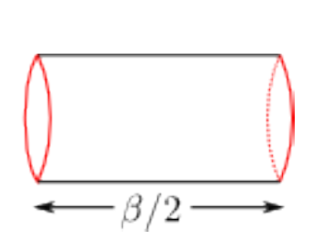
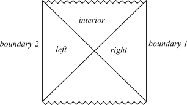
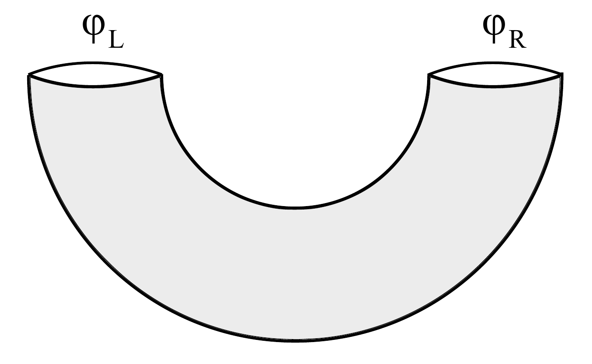

# [hep-th/0106112] [Maldacena] ThermoField Double

<!-- @import "/assets/mathjax.html" -->

### References:
- Maldacena, [hep-th/0106112]
- Harlow's note, [1409.1231]
- Hartman's note, http://hartmanhep.net/topics2015/gravity-lectures.pdf

## What is a ThermoField Double?

$$
  \ket{\mrm{TFD}}
  \equiv \ket{\Psi}
  = \sum_n \sqrt{p_n}\,
      \ket{n}_L \ket{n}_R
  \in \mcal{H}^*_L\otimes\mcal{H}_R
$$

$$
  \rho_R
  = \Tr_L \ket{\Psi} \bra{\Psi}
  = \sum_m {}_L\bra{m}\,
      \Big\{
          \ket{\Psi} \bra{\Psi}
      \Big\}\,
  \ket{m}_L
  = \sum_n p_n\,
      \ket{n}_R \bra{n},
  \quad
  p_n = \frac{e^{-\beta E_n}}{Z}
$$

- First introduced in thermal field theory as a tool for doing calculations --- using a purified double instead of a mixed density matrix. Highly related to the Schwinger-Keldysh (real time) formalism in thermal field theory.

  $$
    \Tr[\mspace{2mu}\rho_R \mcal{O}_R]
    = \mel{\Psi}{\mcal{O}_R}{\Psi}
  $$

- Thermal equilibrium:

  $$
    \rho(t)
    = e^{iHt} \rho(0)\, e^{-iHt}
    = \rho(0)
  $$

  We expects that $\ket{\Psi(t)} = \ket{\Psi(0)}$, hence the left theory $L$ is evolved with negative time, or equivalently, with negative Hamiltonian:

  $$
    \ket{\Psi(t)}
    = e^{-i\,(-H_R)\, t} e^{-iH_R t}\,\ket{\Psi(0)}
    = \ket{\Psi(0)}
  $$

  > **Convention:** the double Hilbert space is usually taken to be $\mcal{H}^\ast_L\otimes\mcal{H}_R$, where the left theory is time-reversed *by definition*; note the star “$\ast$” in $\mcal{H}^*_L$.
  >
  > The unstarred Hilbert space $\mcal{H}_L$ corresponds to the Hamiltonian $H_L$, while for the time-reversed $\mcal{H}^*_L$ we have $(-H_L)$. The total Hamiltonian is thus $H = H_R - H_L$.
  >
  > In the construction of TFD we have $\mcal{H}_L\cong\mcal{H}_R$, so $H = H_R - H_L$ acts trivially on states like $\ket{n}_L \ket{n}_R$. However it is imprecise to say $H_L = H_R$ since they act on different subspaces (as is pointed out by Yuan). More precisely, we have:
  >
  > $$
    \begin{array}{rrcl}
      H_R =& \mathds{0} & \otimes & H_R \\
      H_L =& H_R        & \otimes & \mathds{0} \\
      H = H_R - H_L
          =& -H_R       & \otimes & H_R \\
    \end{array}
    $$
  >
  > See e.g. [1610.01940].

- To prepare (construct) $\ket{\Psi}$ in field theory: Euclidean path integral over a cylinder with length $\tau = \frac{\beta}{2}$ and two ends _unfixed_; note the $\sqrt{p_n}$ coefficient in the definition.

  

    $\ket{\Psi} = $  $
      \sim \displaystyle\int_\bullet^\star
          \DD{\phi}\,e^{-S[\phi]}
      = \mel{\bullet}{e^{-\beta H}}{\star}
    $
     
     
  

- More specifically, by the path integral definition of $\ket{\Psi}$ (unnormalized), we have (see _Hartman_, Chapter 17):

  $$
    \begin{align}
    \bra{\phi'}_L \bra{\phi}_R \,\ket{\Psi}
    &\equiv \mel{\phi}{e^{-\beta H/2}}{\phi'^*}
    \quad \small\text{(by definition)} \\[1ex]
    &= \sum_n \mel{\phi}{e^{-\beta H/2}}{n}
        \bra{n}\ket{\phi'^*} \\
    &= \sum_n e^{-\beta E_n/2}
        \bra{\phi}\ket{n}
        \bra{\phi'}\ket{n} \\
    \end{align}
  $$

  “$*$”: conjugate, more precisely $CPT$ (see _Harlow_'s discussions on Rindler decomposition). Joining two cylinders: $\rho_R = \Tr_L \ket{\Psi}\bra{\Psi}$. Further joining two ends: $Z$.

## $\mrm{AdS}_{d+1}/\mrm{CFT}_d$

- So far, purely field theoretical. **With AdS/CFT,** asymptotic AdS spacetime $\leftrightarrow$ state in CFT, $\ket{\mrm{TFD}}$ becomes a **CFT description** of the AdS Schwarzschild blackhole:

  > Two copies of the CFT in the particular pure (entangled) state $\ket{\mrm{TFD}}$ is _approximately_ described by gravity on the extended AdS Schwarzschild spacetime.

  

  An analog: Rindler vs Schwarzschild; note that there is a $\mbb{R}^{d-1}$ suppressed at each pt in the Rindler diagram, while there is an $S^{d-1}$ suppressed at each pt in the BH Penrose diagram.

  

- $H = H_R - H_L$ is dual to the bulk Hamiltonian that generates time evolution along the isometry $\pd_t$. Recall that the Schwarzschild $t$ coordinate runs ‘backwards’ on the left side.

  

- What is the corresponding description in the bulk? **Hartle--Hawking state**.

  

  Bottom half is the 'Wick-rotated' AdS-Schwarzschild, with radius $r$. At each point in the diagram there is a suppressed $S^{d-1}$. _**Boundary**_ topologies:

  $$
  \begin{align}
  \text{Lorentzian $\pd\,\mrm{AdS}_{d+1}$:}
      &&& \mbb{R}\times S^{d-1}
      && \text{(cylinder)} \\
  \text{Euclidean boundary:}
      &&& S^1_\beta \times S^{d-1}
      && \text{(donut)} \\
  \text{Half Euclidean boundary:}
      &&& [0,\tfrac{\beta}{2}] \times S^{d-1}
      && \text{(“wormhole”)} \\
  \end{align}
  $$

  

  > More about the Euclidean geometry:
  > Euclidean black holes are completely smooth solutions; they do not have an interior or a singularity! In 3D, we have (per Maldacena's convention):
  >
  > $$
      \dd{s}^2
      = \pqty{r^2 - 1} \dd{\tilde{\tau}}^2
        + \frac{1}{r^2 - 1} \dd{r}^2
        + r^2 \dd{\tilde{\phi}}^2
    $$
  >
  > There is an apparent singularity at $r = 1$. However, with certain periodicities the singularity is resolved; the geometry 'caps off' at $r = 1$ (in _Harlow_'s words).
  >
  > With $\tilde{\phi}\in\mathbb{R}$, this describes the 'Rindler' patch of AdS, and the horizon is just that of an accelerated observer; $J = 0$ BTZ, on the other hand, comes from identifying:
  >
  > $$
      \tilde{\phi} \cong \tilde{\phi} + 2k\pi
    $$
  >
  > See e.g. the (BTZ + Henneaux) paper [gr-qc/9302012]. Here we fix the horizon at $r = 1$, therefore the BH mass is in fact encoded in $k$.
  > With $\phi = \tilde{\phi}/k,\ \tau = \tilde{\tau}/k$, we get the usual $\phi \cong \phi + 2\pi$ coordinate.
  >
  > With $
      \rho = \cosh^{-1} r
    $ or $r = \cosh \rho$, at $\rho \simeq 0$ or $r \simeq 1$, we get:
  >
  > $$
      \dd{s}^2
      \simeq \rho^2 k^2 \dd{\tau}^2
        + \dd{\rho}^2
        + \dd{\phi}^2
    $$
  >
  > Non-singular if $
      \tau \cong \tau + \frac{2\pi}{k}
    $, in other words $
      \beta = \frac{2\pi}{k}
    $.
  >
  > Why we want a non-singular Euclidean geometry? My guess: From the perspective of gravitational path integral: we _input_ the inv. temperature $\beta$, and the non-singular geometry with $k = \frac{2\pi}{\beta}$ is selected for being the dominant saddle (for the Euclidean action).
  > <!-- Verify via explicitly? -->

  Hartle-Hawking state is then given by the path integral over _half_ of the Euclidean geometry, with both boundary _unfixed_. Why half? Recall our objective: To find the bulk state that corresponds to $\ket{\mrm{TFD}}$: a CFT state.

    - Matching topologies $[0,\tfrac{\beta}{2}] \times S^{d-1}$
    - Matching temperature $\frac{\beta}{2}$

  > The connection between the extended Schwarzschild geometry and “thermofield dynamics” was first noticed by Israel in 1976. Here we are just pointing out that that in the context of AdS-Schwarzschild geometries this connection becomes _precise_ and that it gives, in principle, a way to describe the interior.

- A similar construction: Minkowski is the purification of Rindler; see Hartman, Chapter 5. Also recall the calculation of Unruh temperature (journal club by Boyang in the last semester), see _Harlow_.

## What can we do?

- **Thermal CFT correlations from AdS:** BTZ is a quotient of AdS, hence we can get $n$-point functions of BTZ using the known results in AdS, via the method of images. Here the operator insertion is at the boundary (CFT).

- **BH physics from CFT:** _In principle_, we can look behind the event horizon with the help of CFT. Although the mapping between states in bulk & boundary can be very complicated.

- **Spinning BH:** adds a factor of $
    e^{-\beta \mu \ell_n/2}
  $ in the double state.

- **Bulk particles:** insertions on the Euclidean boundary.

- **Generalizations:** AdS/AdS slicing, multiple boundaries, etc.

- **One-sided BH:** $\mbb{Z}_2$ quotient, and we have a particular BH pure state.

### Information paradox

- Information loss: left-right correlation calculated in the bulk decays fast: $\propto e^{-\lambda t/\beta}$. Bulk string theory in $\mrm{AdS}_3$, e.g. $\mrm{SL}(2,\mbb{R})$ WZW model gives the same result at tree level. This contradicts unitary of the CFT.

- CFT calculation shows that left-right correlation is bounded below by $e^{-\lambda'S}$, while $S\sim \frac{1}{G_N}$ --- non-perturbative effects in the bulk! _Partial_ resolution: sum over other geometries, e.g. thermal AdS saddle. AdS-Schwarzschild is only the leading contribution.

<!-- vim: set ts=2 sw=2: -->
